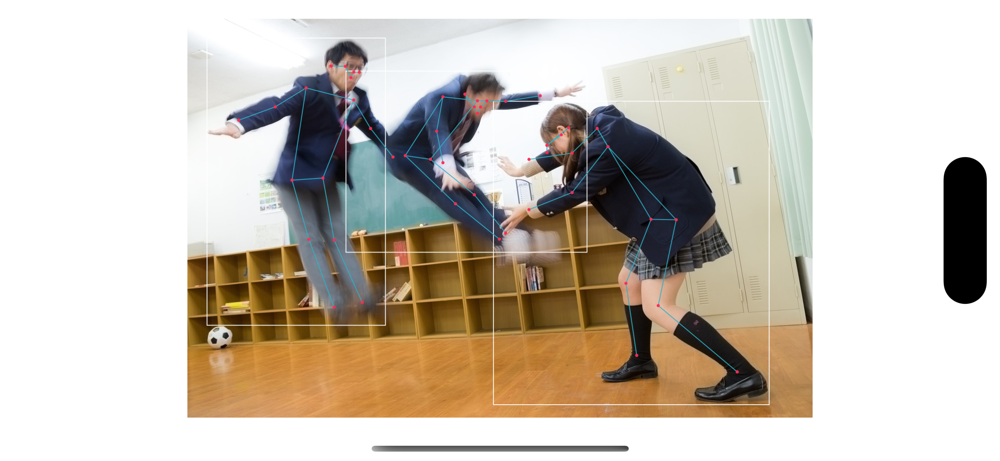

## What is this
TopDown Pose Estimation on iOS and PureSwift.  

- BBox: Yolov7-tiny
- Pose Estimation: ViTPose

## Install

```
$ git clone https://github.com/otmb/TopDownPoseEstimation.git
$ cd TopDownPoseEstimation/TopDownPoseEstimation
$ curl -OL https://github.com/mbotsu/KeypointDecoder/releases/download/0.0.1/vitpose-b256x192_fp16.mlmodel
$ curl -OL https://github.com/mbotsu/KeypointDecoder/releases/download/0.0.1/yolov7-tiny_fp16.mlmodel
```

## Example



## COCO MS val set

Unrated

## References
- [microsoft/human-pose-estimation.pytorch](https://github.com/microsoft/human-pose-estimation.pytorch)
- [PaddlePaddle/PaddleDetection](https://github.com/PaddlePaddle/PaddleDetection/blob/develop/deploy/lite/src/keypoint_postprocess.cc)
- ViTPose to CoreML
    - [mbotsu/20221128_convert.ipynb](https://gist.github.com/mbotsu/3de024c36582f21306e23473e9975841)
- Yolov7 to CoreML
    - [john-rocky/CoreML-Models](https://github.com/john-rocky/CoreML-Models#yolov7) 
        - [Yolov7 Google Colab](https://colab.research.google.com/drive/1QiTlFsN948Xt2e4WgqUB8DnGgwWwtVZS?usp=sharing)
- AffineTransform
    - [Perspective transform from quadrilateral to quadrilateral in Swift](https://rethunk.medium.com/perspective-transform-from-quadrilateral-to-quadrilateral-in-swift-5a9adf2175c3)
- Drawing processing
    - [Detecting human body poses in an image](https://developer.apple.com/documentation/coreml/model_integration_samples/detecting_human_body_poses_in_an_image)
